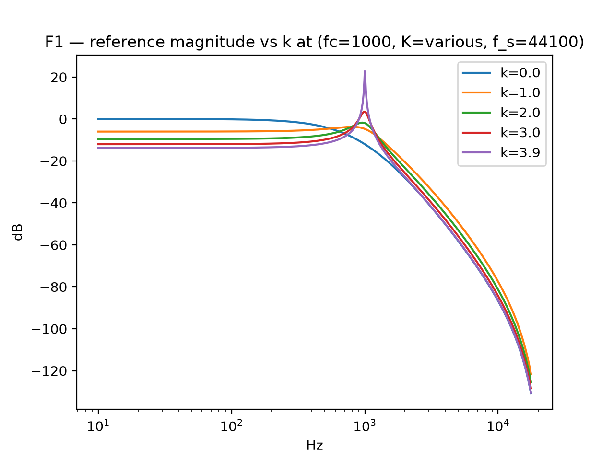
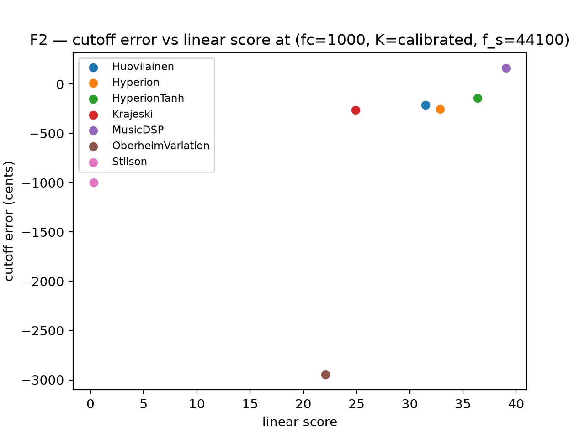
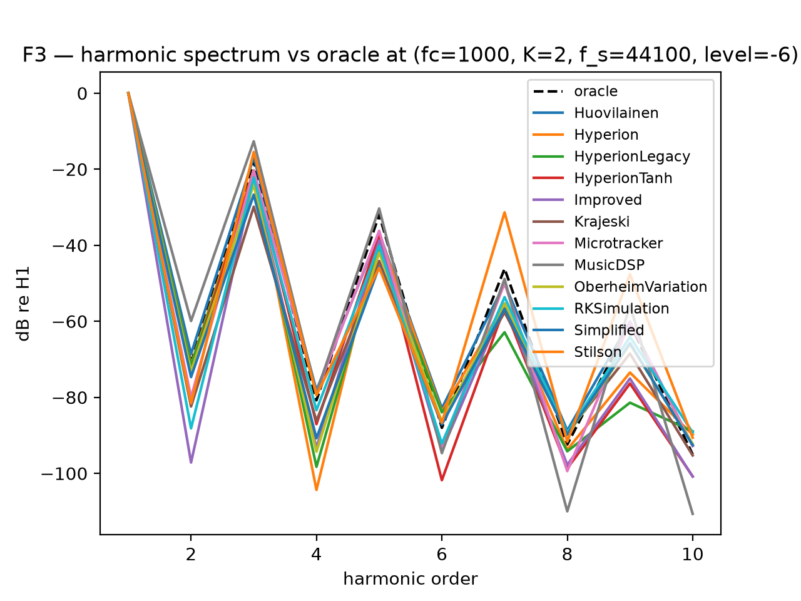
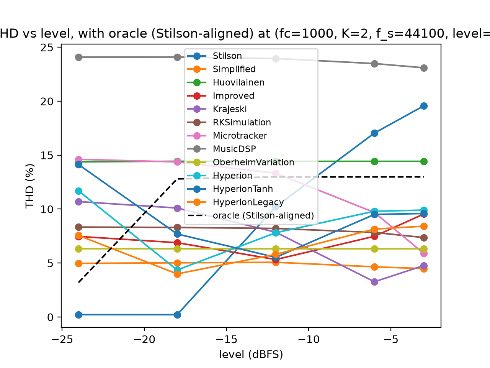
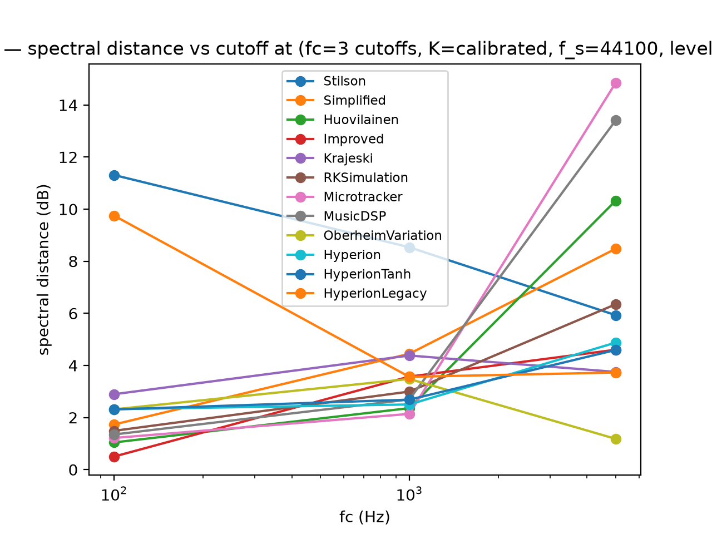
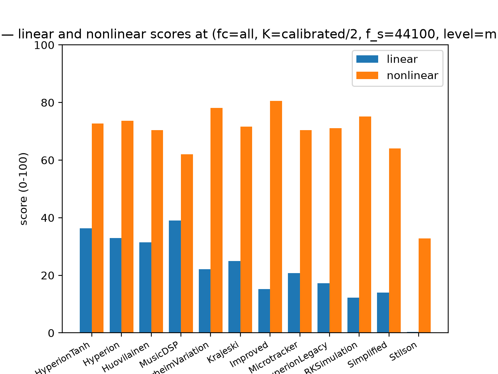

# Moog ladder model faithfulness

All 12 Moog ladder models in this repository, measured against two references and ranked on each. Every measured number in this document is read out of the per-model JSON written by `scripts/faithfulness_eval.py`, or out of the JSON of the legacy 2026-09-28 suite where a card says it is; none of it is typed in by hand.

## 1. Verdict

**HyperionTanh** leads at **54.52** of 100 combined, 1.28 points ahead of **Hyperion** (53.24). That margin is inside the spread the two axes disagree by, so read the two columns rather than the total: HyperionTanh is 36.36 linear against 72.68 nonlinear, and Hyperion is 32.87 against 73.61.

**Stilson** is last at 16.57, on a linear score of 0.30. Its low rank is a measurement, not a mislabel, and the per-model card below says which measurement.

Every one of the 12 models in this repository is in the table, each on both axes. A model with a flagged condition is dropped from it rather than scored zero, and section 4.4 records what the gate did and why.

| Model | Linear | Nonlinear | Combined |
|---|---:|---:|---:|
| HyperionTanh | 36.36 | 72.68 | 54.52 |
| Hyperion | 32.87 | 73.61 | 53.24 |
| Huovilainen | 31.47 | 70.36 | 50.91 |
| MusicDSP | 39.03 | 62.01 | 50.52 |
| OberheimVariation | 22.09 | 78.08 | 50.09 |
| Krajeski | 24.89 | 71.60 | 48.25 |
| Improved | 15.26 | 80.56 | 47.91 |
| Microtracker | 20.77 | 70.38 | 45.58 |
| HyperionLegacy | 17.29 | 71.13 | 44.21 |
| RKSimulation | 12.29 | 75.11 | 43.70 |
| Simplified | 14.04 | 64.02 | 39.03 |
| Stilson | 0.30 | 32.84 | 16.57 |

## 2. What "faithful" means here

Two axes, scored separately, because they measure different things and the models disagree sharply between them. Each score is 0 to 100, where 100 means indistinguishable from the reference on the metrics that axis uses.

**Linear axis: frequency-response shape.** The model's measured magnitude is compared with the analytic continuous-time transfer function H(s) of the analog ladder, ported from D'Angelo and Valimaki's Part I into `reference/moog_ladder_linear.py`. This axis is absolute: the target is an equation rather than a device, so it is checkable without owning a Moog, and it is the axis a model has to win to be usable as a filter.

**Nonlinear axis: spectrum against an oracle.** The model's output is compared with a port of the Part II circuit model in `reference/moog_ladder_oracle.py`, after removing DC offset, bulk delay and one constant gain error. This axis is **model referenced, not hardware referenced**: the yardstick is D'Angelo's circuit simulation, not a measured Moog. No public Moog I/O dataset was found, so nothing in this report can be checked against hardware. Section 6 says what that costs.

**The combined number** is 50% linear and 50% nonlinear, `COMBINED_WEIGHT_LINEAR` in `scripts/faithfulness_eval.py`. The weights are equal because neither axis is the more trustworthy one, and the two are on different scales in different units. Both axes are printed on every row ahead of the total: a model that ranks first on one and last on the other is the most actionable finding this harness can produce, and averaging it away would destroy the result.

## 3. Methodology

**Reference.** `reference/moog_ladder_linear.py`, a NumPy port of D'Angelo's `moog_ladder_linear.m`, for the linear axis; `reference/moog_ladder_oracle.py`, a port of `moog_ladder_nonlinear.m`, for the nonlinear axis. Both are float64 and run in process. The upstream `.m` files are vendored verbatim under `reference/upstream/` and are the authority for the ports.

**`fc` is the leading-pole cutoff, not the -3 dB point.** The reference's own cascade is 3 dB down at 0.435 of its `fc` (measured from `moog_ladder_linear` at k=0), so an `fc` of 1000 Hz is a -3 dB point near 435 Hz. A harness that swept cutoff until the measured curve fell through -3 dB and called that `fc` would be measuring a different filter from the one the reference describes, and the mismatch would read as a modeling error in all twelve models. This is also why the legacy suite's rejection of these models at nominal cutoffs is expected rather than alarming: it was looking for a -3 dB point where there is a leading pole.

**Resonance calibration.** Each model's user-facing resonance `r` is swept over [0, 1] in 0.05 steps, driven with a unit impulse at `fc=1000 Hz`, and the value kept is the one whose measured curve has the lowest RMS dB error against the reference at absolute k=2. That is what puts model and reference at the same *absolute* operating point: the models map `r` to physical feedback differently (Hyperion by a factor of 4, OberheimVariation on a 1..10 scale), so `r` is not comparable across models and the calibration is what makes it so. The calibrated values are in section 4.

**Linear metrics**, from the measured magnitude against the reference, over 20 Hz to 0.4*fs, on a unit impulse at the calibrated resonance: RMS magnitude error (dB, weight 0.3), cutoff error (cents, weight 0.2), passband gain error (dB, weight 0.15), stopband slope error (dB/octave, weight 0.15), peak gain error (dB, weight 0.12), peak frequency error (cents, weight 0.08). The linear score is the weighted mean of 6 cases per model, cutoffs 100, 1000, 5000 Hz at oversampling 0, 4x. Scoring stops at 0.4*fs: a digital implementation must fold the analog stopband back, so out-of-band response is not a modeling error and is excluded from the score. A metric with no finite value scores 0.0, so a model that never rolls off cannot pass by being unmeasured.

**Nonlinear metrics**, on a hard-switched 440 Hz tone at absolute k=2 against the oracle, over 30 cases per model: spectral distance (RMS log-magnitude difference, dB, weight 0.35), time-domain NRMSE (weight 0.25), THD delta in dB (weight 0.25), and the correlation of the two H1..H10 profiles (weight 0.15). The harmonic profile and the THD are both read at the interpolated fundamental rather than at an FFT bin, because a bin centre projects an H2 up to 1.4 dB low and turns a 10 % THD into anything from 0.03 % to 10 %. Cases are cutoffs 100, 1000, 5000 Hz at levels -24, -18, -12, -6, -3 dBFS and the same two oversampling settings.

**Signal path.** Every model is driven through `build/RunFilters --float`, which writes 32-bit IEEE float WAVs; the flag only adds that path, and the default 16-bit PCM output is unchanged (a regression test pins it to PCM16). The float path exists because a 16-bit record quantizes or zeros every tail below about -90 dBFS (one LSB: 20*log10(1/32768) = -90.3), which is not the floor of the models' quietest tails, so the self-oscillation test would read -inf where the model still rings. RunFilters has no single-model mode, so each invocation processes all twelve and the harness keeps the file whose name matches.

**Robustness gate.** A model producing non-finite output on any condition is flagged, removed from the ranking, and reported with the offending parameters named. It is not silently scored zero. In this run: no model was flagged.

## 4. Results

### 4.1 Combined ranking

| Model | Linear | Nonlinear | Combined |
|---|---:|---:|---:|
| HyperionTanh | 36.36 | 72.68 | 54.52 |
| Hyperion | 32.87 | 73.61 | 53.24 |
| Huovilainen | 31.47 | 70.36 | 50.91 |
| MusicDSP | 39.03 | 62.01 | 50.52 |
| OberheimVariation | 22.09 | 78.08 | 50.09 |
| Krajeski | 24.89 | 71.60 | 48.25 |
| Improved | 15.26 | 80.56 | 47.91 |
| Microtracker | 20.77 | 70.38 | 45.58 |
| HyperionLegacy | 17.29 | 71.13 | 44.21 |
| RKSimulation | 12.29 | 75.11 | 43.70 |
| Simplified | 14.04 | 64.02 | 39.03 |
| Stilson | 0.30 | 32.84 | 16.57 |

### 4.2 Linear ranking

Sorted best first. The third column is the axis's own score; the fourth names the metric that gave the model the least of its linear credit, with the error as measured.

| # | Model | Linear | worst-scoring linear metric |
|---:|---|---:|---|
| 1 | MusicDSP | 39.03 | RMS magnitude error: 7.04 dB |
| 2 | HyperionTanh | 36.36 | RMS magnitude error: 6.10 dB |
| 3 | Hyperion | 32.87 | RMS magnitude error: 6.79 dB |
| 4 | Huovilainen | 31.47 | RMS magnitude error: 9.09 dB |
| 5 | Krajeski | 24.89 | peak frequency error: 416.37 cents low |
| 6 | OberheimVariation | 22.09 | RMS magnitude error: 9.89 dB |
| 7 | Microtracker | 20.77 | RMS magnitude error: 9.20 dB |
| 8 | HyperionLegacy | 17.29 | RMS magnitude error: 10.32 dB |
| 9 | Improved | 15.26 | RMS magnitude error: 11.84 dB |
| 10 | Simplified | 14.04 | RMS magnitude error: 12.09 dB |
| 11 | RKSimulation | 12.29 | RMS magnitude error: 8.86 dB |
| 12 | Stilson | 0.30 | RMS magnitude error: 116.63 dB |

### 4.3 Nonlinear ranking

Sorted best first, against the model-aligned oracle. The two THD columns are at the operating point the figures use; the oracle column differs from model to model because `align_signals` shifts the oracle by the model's own cross-correlation, so the same input leaves a different oracle on each record.

| # | Model | Nonlinear | model THD at -6 dBFS (%) | oracle THD on the same record (%) |
|---:|---|---:|---:|---:|
| 1 | Improved | 80.56 | 7.48 | 12.97 |
| 2 | OberheimVariation | 78.08 | 6.33 | 12.97 |
| 3 | RKSimulation | 75.11 | 7.84 | 12.98 |
| 4 | Hyperion | 73.61 | 9.80 | 12.97 |
| 5 | HyperionTanh | 72.68 | 9.51 | 12.97 |
| 6 | Krajeski | 71.60 | 3.27 | 12.97 |
| 7 | HyperionLegacy | 71.13 | 8.15 | 12.97 |
| 8 | Microtracker | 70.38 | 9.69 | 12.99 |
| 9 | Huovilainen | 70.36 | 14.43 | 13.00 |
| 10 | Simplified | 64.02 | 4.65 | 12.96 |
| 11 | MusicDSP | 62.01 | 23.48 | 13.01 |
| 12 | Stilson | 32.84 | 17.05 | 12.99 |

### 4.4 Models excluded from the ranking

No model was flagged: all 12 carry `status: ok` and hold both axes, so nothing is excluded here. The gate that would have removed one is still live. A model producing non-finite output on any condition is named in this section with the reason and dropped from the ranking, and a report that dropped one silently would read as a measurement that was never taken.

### 4.5 Calibrated resonance

The user-facing `r` each model needed to sit at absolute k=2. These are not comparable across models on their own: the models map `r` to physical feedback differently, which is exactly why the sweep calibrates rather than fixing `r`.

| Model | calibrated r |
|---|---:|
| HyperionTanh | r=0.60 |
| Hyperion | r=0.55 |
| Huovilainen | r=0.55 |
| MusicDSP | r=0.50 |
| OberheimVariation | r=1.00 |
| Krajeski | r=0.50 |
| Improved | r=1.00 |
| Microtracker | r=0.40 |
| HyperionLegacy | r=0.45 |
| RKSimulation | r=1.00 |
| Simplified | r=0.65 |
| Stilson | r=0.85 |

Self-oscillation, measured at the top of each model's own `r` range. A tail above -60 dBFS long after the burst ends counts as ringing; a run that diverges has no tail to measure and is flagged instead of being recorded as ringing.

| Model | r=0.50 | r=0.90 | r=1.00 |
|---|---:|---:|---:|
| HyperionTanh | quiet (-102.00 dBFS) | quiet (-91.57 dBFS) | rings (-27.40 dBFS) |
| Hyperion | quiet (-102.00 dBFS) | quiet (-91.57 dBFS) | rings (-29.11 dBFS) |
| Huovilainen | quiet (-112.27 dBFS) | quiet (-109.12 dBFS) | rings (-18.41 dBFS) |
| MusicDSP | quiet (-106.01 dBFS) | rings (-6.62 dBFS) | rings (-5.61 dBFS) |
| OberheimVariation | quiet (-104.61 dBFS) | quiet (-103.54 dBFS) | quiet (-103.32 dBFS) |
| Krajeski | quiet (-98.85 dBFS) | rings (-16.38 dBFS) | rings (-14.33 dBFS) |
| Improved | quiet (-105.29 dBFS) | quiet (-107.43 dBFS) | quiet (-107.94 dBFS) |
| Microtracker | quiet (-113.44 dBFS) | quiet (-110.62 dBFS) | quiet (-101.56 dBFS) |
| HyperionLegacy | quiet (-100.94 dBFS) | quiet (-83.62 dBFS) | quiet (-70.10 dBFS) |
| RKSimulation | quiet (-106.05 dBFS) | quiet (-108.57 dBFS) | quiet (-109.16 dBFS) |
| Simplified | quiet (-101.67 dBFS) | quiet (-100.86 dBFS) | quiet (-100.29 dBFS) |
| Stilson | quiet (-93.25 dBFS) | quiet (-79.66 dBFS) | rings (-34.87 dBFS) |

## 5. Per-model cards

One card per model, in combined-score order. The linear figures below are the means over the cases that produced a measurement; where a case could not be measured the card says so rather than letting the mean speak for it.

### HyperionTanh

**Combined 54.52, 1 of 12.** Linear 36.36 (2 of 12), nonlinear 72.68 (5 of 12), at a calibrated r=0.60. The stronger axis is linear and the weaker is nonlinear: a reader who wants the filter's shape should read the linear number, one who wants its behaviour under a hard-switched tone should read the nonlinear one.
Linear axis: the most credit it earned was cutoff error (127.94 cents low), worth 0.14 of the 0.36 it earned on the axis, and the least was RMS magnitude error (6.10 dB), worth 0.00.
Self-oscillation: rings at r=1.00, loudest tail -27.40 dBFS, quiet at the rest. It is reachable inside the user range, not only at the top of it.

### Hyperion

**Combined 53.24, 2 of 12.** Linear 32.87 (3 of 12), nonlinear 73.61 (4 of 12), at a calibrated r=0.55. The stronger axis is linear and the weaker is nonlinear: a reader who wants the filter's shape should read the linear number, one who wants its behaviour under a hard-switched tone should read the nonlinear one.
Linear axis: the most credit it earned was stopband slope error (2.18 dB/octave), worth 0.12 of the 0.33 it earned on the axis, and the least was RMS magnitude error (6.79 dB), worth 0.00.
Self-oscillation: rings at r=1.00, loudest tail -29.11 dBFS, quiet at the rest. It is reachable inside the user range, not only at the top of it.

### Huovilainen

**Combined 50.91, 3 of 12.** Linear 31.47 (4 of 12), nonlinear 70.36 (9 of 12), at a calibrated r=0.55. The stronger axis is linear and the weaker is nonlinear: a reader who wants the filter's shape should read the linear number, one who wants its behaviour under a hard-switched tone should read the nonlinear one.
Linear axis: the most credit it earned was peak gain error (1.29 dB high), worth 0.09 of the 0.31 it earned on the axis, and the least was RMS magnitude error (9.09 dB), worth 0.00.
Self-oscillation: rings at r=1.00, loudest tail -18.41 dBFS, quiet at the rest. It is reachable inside the user range, not only at the top of it.

### MusicDSP

**Combined 50.52, 4 of 12.** Linear 39.03 (1 of 12), nonlinear 62.01 (11 of 12), at a calibrated r=0.50. The stronger axis is linear and the weaker is nonlinear: a reader who wants the filter's shape should read the linear number, one who wants its behaviour under a hard-switched tone should read the nonlinear one.
Linear axis: the most credit it earned was cutoff error (30.64 cents high), worth 0.18 of the 0.39 it earned on the axis, and the least was RMS magnitude error (7.04 dB), worth 0.00.
Self-oscillation: rings at r=0.90, r=1.00, loudest tail -5.61 dBFS, quiet at the rest. It is reachable inside the user range, not only at the top of it.

### OberheimVariation

**Combined 50.09, 5 of 12.** Linear 22.09 (6 of 12), nonlinear 78.08 (2 of 12), at a calibrated r=1.00. The stronger axis is nonlinear and the weaker is linear: a reader who wants the filter's shape should read the linear number, one who wants its behaviour under a hard-switched tone should read the nonlinear one.
Linear axis: the most credit it earned was stopband slope error (1.66 dB/octave), worth 0.13 of the 0.22 it earned on the axis, and the least was RMS magnitude error (9.89 dB), worth 0.00.
Self-oscillation: no tail stayed above -60 dBFS at r=0.50, r=0.90, r=1.00, so this run did not observe it oscillating at the top of its own resonance range.

### Krajeski

**Combined 48.25, 6 of 12.** Linear 24.89 (5 of 12), nonlinear 71.60 (6 of 12), at a calibrated r=0.50. The stronger axis is linear and the weaker is nonlinear: a reader who wants the filter's shape should read the linear number, one who wants its behaviour under a hard-switched tone should read the nonlinear one.
Linear axis: the most credit it earned was stopband slope error (3.76 dB/octave), worth 0.10 of the 0.25 it earned on the axis, and the least was peak frequency error (416.37 cents low), worth 0.00.
Self-oscillation: rings at r=0.90, r=1.00, loudest tail -14.33 dBFS, quiet at the rest. It is reachable inside the user range, not only at the top of it.

### Improved

**Combined 47.91, 7 of 12.** Linear 15.26 (9 of 12), nonlinear 80.56 (1 of 12), at a calibrated r=1.00. The stronger axis is nonlinear and the weaker is linear: a reader who wants the filter's shape should read the linear number, one who wants its behaviour under a hard-switched tone should read the nonlinear one.
Linear axis: the most credit it earned was stopband slope error (2.13 dB/octave), worth 0.12 of the 0.15 it earned on the axis, and the least was RMS magnitude error (11.84 dB), worth 0.00.
Unmeasurable on this model: cutoff error (no finite value in any of the 6 cases). Each is n/a in section 9.1 and scores zero on the way to the total, because a curve that never falls through -3 dB has no cutoff to report and must not collect the credit for one it did not earn.
Self-oscillation: no tail stayed above -60 dBFS at r=0.50, r=0.90, r=1.00, so this run did not observe it oscillating at the top of its own resonance range.
Known artifact, carried from the 2026-09-28 legacy suite rather than measured here: The legacy suite reported `dc_gain = -0.99997` (approximately -1) at its step operating point, inverting the step instead of low-passing it; the inversion persists across resonance, shrinking in magnitude. This sweep drives impulses and tones, not a step, so it has no `dc_gain` of its own with which to confirm or contradict that.

### Microtracker

**Combined 45.58, 8 of 12.** Linear 20.77 (7 of 12), nonlinear 70.38 (8 of 12), at a calibrated r=0.40. The stronger axis is linear and the weaker is nonlinear: a reader who wants the filter's shape should read the linear number, one who wants its behaviour under a hard-switched tone should read the nonlinear one.
Linear axis: the most credit it earned was stopband slope error (3.73 dB/octave), worth 0.10 of the 0.21 it earned on the axis, and the least was RMS magnitude error (9.20 dB), worth 0.00.
Unmeasurable on this model: cutoff error (no finite value in any of the 6 cases). Each is n/a in section 9.1 and scores zero on the way to the total, because a curve that never falls through -3 dB has no cutoff to report and must not collect the credit for one it did not earn.
Self-oscillation: no tail stayed above -60 dBFS at r=0.50, r=0.90, r=1.00, so this run did not observe it oscillating at the top of its own resonance range.

### HyperionLegacy

**Combined 44.21, 9 of 12.** Linear 17.29 (8 of 12), nonlinear 71.13 (7 of 12), at a calibrated r=0.45. The stronger axis is nonlinear and the weaker is linear: a reader who wants the filter's shape should read the linear number, one who wants its behaviour under a hard-switched tone should read the nonlinear one.
Linear axis: the most credit it earned was peak gain error (1.53 dB low), worth 0.09 of the 0.17 it earned on the axis, and the least was RMS magnitude error (10.32 dB), worth 0.00.
Unmeasurable on this model: cutoff error (no finite value in any of the 6 cases). Each is n/a in section 9.1 and scores zero on the way to the total, because a curve that never falls through -3 dB has no cutoff to report and must not collect the credit for one it did not earn.
Self-oscillation: no tail stayed above -60 dBFS at r=0.50, r=0.90, r=1.00, so this run did not observe it oscillating at the top of its own resonance range.
Known artifact, carried from the 2026-09-28 legacy suite rather than measured here: The legacy suite's step record is 743.04 ms long and this model's output did not enter the 2 % band until 742.27 ms at r=0.50 and 742.77 ms at r=0.90 - it settled only in the last millisecond of the window at those two resonances. (At r=0.00 it settled promptly, in 27 ms.) MusicDSP at r=0.90 reports 743.04 ms, which is the record length: the metric's way of saying it never settled inside the window at all. This sweep drives impulses and tones, not a step, so it has no `dc_gain` of its own with which to confirm or contradict that.

### RKSimulation

**Combined 43.70, 10 of 12.** Linear 12.29 (11 of 12), nonlinear 75.11 (3 of 12), at a calibrated r=1.00. The stronger axis is nonlinear and the weaker is linear: a reader who wants the filter's shape should read the linear number, one who wants its behaviour under a hard-switched tone should read the nonlinear one.
Linear axis: the most credit it earned was stopband slope error (4.31 dB/octave), worth 0.10 of the 0.12 it earned on the axis, and the least was RMS magnitude error (8.86 dB), worth 0.00.
Unmeasurable on this model: cutoff error (no finite value in any of the 6 cases). Each is n/a in section 9.1 and scores zero on the way to the total, because a curve that never falls through -3 dB has no cutoff to report and must not collect the credit for one it did not earn.
Self-oscillation: no tail stayed above -60 dBFS at r=0.50, r=0.90, r=1.00, so this run did not observe it oscillating at the top of its own resonance range.

### Simplified

**Combined 39.03, 11 of 12.** Linear 14.04 (10 of 12), nonlinear 64.02 (10 of 12), at a calibrated r=0.65. The stronger axis is linear and the weaker is nonlinear: a reader who wants the filter's shape should read the linear number, one who wants its behaviour under a hard-switched tone should read the nonlinear one.
Linear axis: the most credit it earned was peak gain error (0.95 dB low), worth 0.10 of the 0.14 it earned on the axis, and the least was RMS magnitude error (12.09 dB), worth 0.00.
Self-oscillation: no tail stayed above -60 dBFS at r=0.50, r=0.90, r=1.00, so this run did not observe it oscillating at the top of its own resonance range.

### Stilson

**Combined 16.57, 12 of 12.** Linear 0.30 (12 of 12), nonlinear 32.84 (12 of 12), at a calibrated r=0.85. The stronger axis is linear and the weaker is nonlinear: a reader who wants the filter's shape should read the linear number, one who wants its behaviour under a hard-switched tone should read the nonlinear one.
Linear axis: no credit on any of the six metrics, to the two decimal places this report prints. All six sit at or within a rounding step of the worst value the scale admits, so the axis total is the floor rather than an average of mediocre results.
The fc100.0_os0 case is not a badly tuned response but no response at all: a -591.24 dB passband gain error against a reference within a few dB of unity puts the measured magnitude on the -600 dB floor `spectrum_db` applies to digital silence. One dead case out of six dominates the mean, which is why the aggregate reads worse than the live cases do.
Self-oscillation: rings at r=1.00, loudest tail -34.87 dBFS, quiet at the rest. It is reachable inside the user range, not only at the top of it.
Known artifact, carried from the 2026-09-28 legacy suite rather than measured here: The legacy suite reported `dc_gain = 0.0000` at its step operating point, emitting literal zeros to a step. This sweep drives impulses and tones, not a step, so it has no `dc_gain` of its own with which to confirm or contradict that.
Known artifact, carried from the 2026-09-28 legacy suite rather than measured here: In that suite's THD sweep, at its -6 dBFS input level (fc=5000, r=0.00) this model reported THD 0.0000 %, with all five of its harmonics sitting at -240.0 dB, the sentinel that suite writes for digital silence: the figure is the sentinel rather than a measurement of low distortion. Huovilainen read 0.0023 % (0.002342 % stored) at the same level, which is the ordering at that floor. Section 4.3's THD column is a different sweep, at fc=1000 on this harness rather than fc=5000 on that one, where this model reads 17.05 %, so the two figures are not comparable.

## 6. Threats to validity

- **The nonlinear axis is measured against a model, not against hardware.** Every nonlinear number here is a distance from D'Angelo's Part II circuit simulation, run at absolute k=2 and aligned to each model by cross-correlation. No public Moog I/O dataset was found, so that axis cannot be independently verified here, and a model that is wrong in the same way the port is wrong would score well. The linear axis does not share this problem: its reference is an equation.
- **The D'Angelo errata were not read.** `reference/upstream/PROVENANCE.md` records both author errata (`errata_gladder1.pdf`, `errata_gladder2.pdf`) as unread: they were not machine-readable in this environment. A correction in either that applies to these ports would move the linear reference and therefore every linear score in this report. This is the one open item a human with the PDFs can close.
- **The comparison port may be coincidentally matched.** The oracle is D'Angelo's delay-free implementation, and a candidate model that happens to share its algebra with that implementation scores well for a reason that has nothing to do with the hardware. The report cannot separate that from genuine agreement, and the linear axis is the only place the two are checked independently of each other.
- **The filter libraries may be mislabeled.** `Stilson`, `Huovilainen`, `MusicDSP` and `RKSimulation` are ports of published code by other authors. A port that does not match the paper it names would be measured correctly and attributed wrongly, and this harness has no way to tell.
- **The legacy test did not measure the -3 dB point.** The 2026-09-28 suite swept cutoff and read the response at the requested frequency, not at the point where the cascade is down 3 dB, so its cutoff rejections are not evidence about these models. The step and THD artifacts quoted in section 5 are from that suite and are the only facts carried over from it, and each names the operating point that suite measured it at: its THD sweep ran at fc=5000, not the fc=1000 of section 4.3.
- **The score scales are choices.** Each metric maps an error to 0..1 over a hand-chosen best and worst, and the weights are hand-chosen too. A different reasonable set reorders the middle of the table. The two axis scores are in the record next to the raw metrics in section 9.1, so a reader can rescore without re-running anything.
- **Defaults only.** Every model is measured at its own defaults. Hyperion ships drive, thermal, ADAA and three quality tiers; ranking its defaults is not the same as ranking the model, and no best-config row is reported here.

## 7. Figures

The six committed PNGs under `docs/moog-faithfulness/plots/`, referenced by path relative to this report. Each caption below is the figure's own title, built by `fig_caption` from the same operating point `generate_figures` drew it at, so a caption cannot drift from the picture.

F3 and F4 draw one oracle, and the title names whose it is: the oracle on a record is aligned to the model it was measured against, so `Stilson`'s view of it is the one plotted. There is no single oracle curve to draw here.



F1 — reference magnitude vs k at (fc=1000, K=various, f_s=44100)

The headline shape target: the analytic magnitude of the analog ladder at one leading-pole cutoff, swept over the whole usable k range. Every model is scored against this family, and against k=2 in particular.



F2 — cutoff error vs linear score at (fc=1000, K=calibrated, f_s=44100)

One dot per model: how far the model's -3 dB point sits from the reference's at the calibrated resonance, against its linear score. A dot at zero error and low score is a model that gets the corner right and the rest of the curve wrong.



F3 — harmonic spectrum vs oracle (Stilson-aligned) at (fc=1000, K=2, f_s=44100, level=-6)

H1 through H10 in dB relative to each signal's own fundamental, for every model and for one model's oracle. The oracle is named in the title because it is model-aligned: align_signals shifts it by the model's own cross-correlation, so there is no single oracle curve to draw.



F4 — THD vs level, with oracle (Stilson-aligned) at (fc=1000, K=2, f_s=44100, level=5 levels)

Total harmonic distortion in percent against input level, from the same model-aligned oracle. A model whose line is flat across the five levels is not distortion-free, it is not responding to level at all.



F5 — spectral distance vs cutoff at (fc=3 cutoffs, K=calibrated, f_s=44100, level=-6)

RMS log-magnitude distance to the oracle at each of the three cutoffs, at one level. It separates models whose error is a fixed offset from models whose error grows with frequency.



F6 — linear and nonlinear scores at (fc=all, K=calibrated/2, f_s=44100, level=mixed)

The two axes side by side, models ordered by the combined score. The gaps between the two bars in a pair are the finding: a model that is long on one axis and short on the other is not average.

## 8. Reproduction

The whole run, from a built `build/RunFilters`:

```bash
python scripts/faithfulness_eval.py --models All \
  --out-dir filter_validation/faithfulness/run1 \
  --write-figs /tmp/figs-run1
```

The report is then regenerated from the run directory:

```bash
python scripts/faithfulness_report.py filter_validation/faithfulness/run1
```

Environment, read from the `git_head` and `software` keys that every record in that run carries (here `Stilson.json`) rather than from the machine this file was written on:

- `git_head` b474371
- python 3.14.7
- numpy 2.5.3
- scipy 1.18.1

`scripts/filter_verification.py` is not modified by any of this work: the legacy suite and the figures quoted in section 5 are read-only inputs to the report, and every measurement in it was taken by `scripts/faithfulness_eval.py`. The figures are byte-identical to the committed PNGs when regenerated from the same records.

The run directory is gitignored; the numbers above are regenerable from a fresh clone by building `RunFilters` and re-running the sweep, and the committed report can then be diffed against the regenerated one.

## 9. Appendix

### 9.1 Every linear metric, per model

The six scored metrics as recorded, before they were mapped to a score. n/a is a measurement that could not be taken, never a zero.

| Model | RMS magnitude error (dB) | cutoff error (cents) | passband gain error (dB) | stopband slope error (dB/octave) | peak gain error (dB) | peak frequency error (cents) |
|---|---:|---:|---:|---:|---:|---:|
| HyperionTanh | 6.10 dB | 127.94 cents low (3 of 6 cases) | 3.54 dB low | 2.26 dB/octave (4 of 6 cases) | 3.26 dB high | 144.50 cents low |
| Hyperion | 6.79 dB | 244.76 cents low (3 of 6 cases) | 3.90 dB low | 2.18 dB/octave (4 of 6 cases) | 1.63 dB high | 195.94 cents low |
| Huovilainen | 9.09 dB | 218.63 cents low (3 of 6 cases) | 6.71 dB low | 4.49 dB/octave (4 of 6 cases) | 1.29 dB high | 220.43 cents low |
| MusicDSP | 7.04 dB | 30.64 cents high | 4.02 dB low | 1.75 dB/octave (4 of 6 cases) | 10.33 dB high | 12.25 cents low |
| OberheimVariation | 9.89 dB | 2899.68 cents low (2 of 6 cases) | 1.17 dB high | 1.66 dB/octave (4 of 6 cases) | 7.70 dB low | 6299.39 cents low |
| Krajeski | 5.88 dB | 394.80 cents low (3 of 6 cases) | 1.97 dB low | 3.76 dB/octave (4 of 6 cases) | 1.70 dB high | 416.37 cents low |
| Improved | 11.84 dB | n/a | 5.35 dB low | 2.13 dB/octave (4 of 6 cases) | 4.54 dB low | 842.53 cents low |
| Microtracker | 9.20 dB | n/a | 5.93 dB low | 3.73 dB/octave (4 of 6 cases) | 2.50 dB low | 227.78 cents low |
| HyperionLegacy | 10.32 dB | n/a | 5.75 dB low | 5.32 dB/octave (4 of 6 cases) | 1.53 dB low | 475.15 cents low |
| RKSimulation | 8.86 dB | n/a | 2.64 dB low | 4.31 dB/octave (4 of 6 cases) | 5.56 dB low | 766.61 cents low |
| Simplified | 12.09 dB | 871.27 cents low (1 of 6 cases) | 4.97 dB low | 8.85 dB/octave (4 of 6 cases) | 0.95 dB low | 688.23 cents low |
| Stilson | 116.63 dB | 577.50 cents high (5 of 6 cases) | 90.22 dB low | 20.37 dB/octave (4 of 6 cases) | 5.85 dB high | 1851.61 cents low |

"(N of 6 cases)" marks a mean that stands on fewer than all six measurements: the metric was unmeasurable at the rest, so its value is a weaker claim than the table's other cells.

### 9.2 What was not measured, and why

- **Perceptual quality.** No listening panel was run and no audio was compared by ear. Any claim that a model "sounds most like a Moog" would be unfounded, so the question is out of scope rather than answered weakly.
- **Out of band response.** Reported by `shape_metrics` but excluded from the linear score. A digital implementation must fold the analog stopband back, and scoring that fold as a modeling error would punish every model for the same correct decision.
- **Aliasing.** Each model is driven at oversampling 1x and 4x, and both sets of cases go into the score, so oversampling is measured as an operating condition rather than as an artifact study. The spectral images an oversampled filter folds back were not isolated, so no claim is made here about how much aliasing any model adds.
- **Intermodulation.** The nonlinear set drives a single tone, so it measures harmonic distortion and nothing else. Intermodulation needs a two-tone drive, which this harness does not run, so the distortion figures say nothing about it either way.
- **Parameter sweeps.** Resonance is calibrated to one absolute k and the cutoffs are three fixed points. The models disagree most in how they map `r` to physical feedback, and that disagreement is sampled at one target rather than swept.
- **CPU cost.** An engineering input rather than a faithfulness one, and not measured by this harness.

### 9.3 References

- S. D'Angelo and V. Valimaki, "Generalized Moog Ladder Filter: Part I - Linear Analysis and Parameterization", IEEE/ACM TASLP 22(12), 1825-1832, 2014. DOI 10.1109/TASLP.2014.2352495. The source of `reference/moog_ladder_linear.py`.
- S. D'Angelo and V. Valimaki, "Generalized Moog Ladder Filter: Part II - Explicit Nonlinear Model through a Novel Delay-Free Implementation Method", IEEE/ACM TASLP 22(12), 1873-1883, 2014. DOI 10.1109/TASLP.2014.2352556. The source of `reference/moog_ladder_oracle.py`.
- P. D. Zolzer and F. Vranken (eds), DAFX-DAFX02, 2nd edition, 2002, for the Moog~ model named in StilsonModel.h, after P. Stilson and J. O. Smith, "Using Algorithms to Synthesize Polyphonic Programmable Filters", Computer Music Journal 20(2), 1996.
- A. Huovilainen, "Non-linear digital implementation of the Moog ladder filter", Proceedings of the Computer Music Conference, 2004, for the Huovilainen model.
- R. J. E. Daly, "Moog VCF Analysis", MSc project, University of Edinburgh, 2012. Related prior comparison of ladder-filter implementations; listed as prior work, not as a source of specific values.

The models' own provenance and licences are listed in `README.md`.
